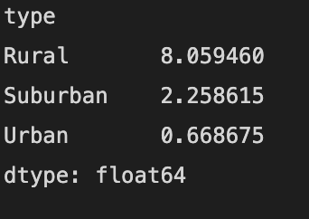

# PyBer_Analysis

# Overview

The purpose of this code is to create a summary DataFrame of the ride-sharing data by city type. Then, using Pandas and Matplotlib, I need to create a multiple-line graph that shows the total weekly fares for each city type.  We will use the data to show how data differs by city type and how management can use this data to make decisions.

# Results

## Ride-Share Data

### Total Rides

### Total Drivers

### Total Fares

### Average Fare Per Ride

### Average Fare Per Driver

From this data, management should be able to quickly made decisions when it comes differences in ride-share profitability and user frequency.

# Summary

Mrs. V.Isualize, please note that that the above line graph shows only between center date parameters but can be modified as necessary.  Additionally, the chart was created by using the 'W' function but can also be modified to display annually, or monthly as needed.  Lastly, if needed the column and index lists can be pivoted arount the access if that creates a more desireable graph for future needs.  Thank you.